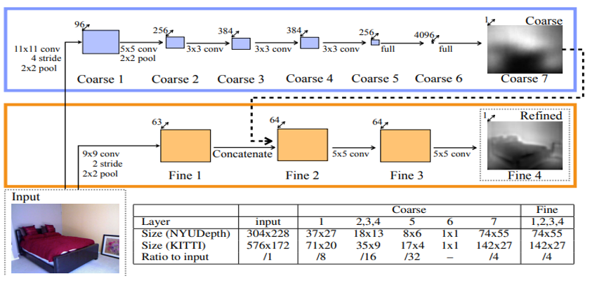

# Monocular Depth Estimation for Autonomous Driving

*Historic and Modern Architectures*

This repository presents a comparative study of *monocular depth estimation for autonomous driving* using two representative model architectures: a *historic CNN-based approach (Eigen Network, 2014)* and a *modern Transformer-based approach (DPT-Hybrid)*.
Both models are evaluated on the *KITTI Eigen split* and further tested under *challenging environmental conditions using the Virtual KITTI benchmark*.

---

## Overview

Depth perception is a critical requirement in autonomous driving, enabling obstacle avoidance, lane understanding, and 3D scene reconstruction.
This project compares how *early convolutional architectures* and *modern Transformer-based models* estimate depth from a single RGB image under both *standard and adverse visual conditions*.

---

## Architectures Used

### Historical Implementation – Eigen Network (2014)

The *Eigen Network (2014)* represents the first deep learning-based approach for monocular depth estimation in road scenes.

*Key characteristics:*

* Two-stage CNN architecture:

  * *Global Coarse Network:* captures the overall depth structure of the scene
  * *Local Fine Network:* refines predictions using local image details
* Multi-scale convolutional feature learning
* Limited global context due to convolutional receptive fields

*Use case:*
Early autonomous driving depth estimation with coarse global understanding and local refinement.

---

### Modern Architecture – Dense Prediction Transformer (DPT-Hybrid)

The *Depth Prediction Transformer (DPT-Hybrid)* is a Transformer-based model designed for high-accuracy monocular depth estimation.

*Key characteristics:*

* Hybrid architecture combining:

  * *CNN backbone (ResNet-50)* for low-level feature extraction
  * *Vision Transformer (ViT)* for global context modeling via self-attention
* *Reassemble operation* to convert transformer tokens back into spatial feature maps
* Produces globally consistent and locally precise depth maps

*Use case:*
State-of-the-art depth estimation for complex autonomous driving environments.

---

## Datasets Used

### KITTI Eigen Split

* Outdoor road scenes with sparse LiDAR-based ground-truth depth
* Training samples: ~23,000
* Test samples: 697 (had only 625 scenes for testing)
* Sparse depth regions are masked during training and evaluation
* Link to the eigen split tested - https://www.kaggle.com/datasets/awsaf49/kitti-eigen-split-dataset

### Virtual KITTI Benchmark (Challenging Conditions)

To evaluate robustness under adverse conditions, *both Eigen Network and DPT-Hybrid* were additionally tested on the *Virtual KITTI benchmark*, which provides photorealistic synthetic scenes with controlled environmental variations.

*Evaluated conditions:*

* Clone
* Fog
* Morning
* Overcast
* Rain
* Sunset

This evaluation assesses each model’s ability to maintain depth estimation accuracy under visibility degradation and illumination changes commonly encountered in real-world autonomous driving.

* Link to Virtual KITTI Benchmark Dataset - https://datasetninja.com/virtual-kitti
---

## Task Definition

*Monocular Depth Estimation*

* *Input:* Single RGB image
* *Output:* Dense depth map (up to 80 meters)
* *Application:* Scene understanding, obstacle distance estimation, and navigation support in autonomous vehicles

---

## Evaluation Metrics

The following standard depth-estimation metrics are used across both benchmarks:

* *δ < 1.25, δ < 1.25², δ < 1.25³:* threshold-based accuracy
* *Abs Rel:* Absolute Relative Error
* *Sq Rel:* Squared Relative Error
* *RMSE:* Root Mean Squared Error
* *RMSE log:* Log-space RMSE
* *SIlog (Scale Invarianr Log RMSE):* Scale-invariant logarithmic error

Higher delta values and lower error values indicate better performance.

---

## Key Observation

While the Eigen Network demonstrates the effectiveness of early CNN-based depth estimation, the DPT-Hybrid consistently shows improved robustness and accuracy, particularly under challenging conditions in the Virtual KITTI benchmark.
This highlights the advantage of *Transformer-based global context modeling* for reliable depth perception in autonomous driving.

---

## Videos Created for Both Eigen and DPT models on KITTI dataset

* Eigen Gray Scale Prediction Video - [Eigen Gray Video](https://drive.google.com/file/d/1pogLfUXnhRSA_AosAwwJ_JWf23I6eFOJ/view?usp=sharing)

* Eigen Inferno Prediction Video -[Eigen Inferno Video](https://drive.google.com/file/d/1HRUc92FfYY2zJtLOENAioKFBp5Ng2ytN/view?usp=sharing)

* DPT (Depth Prediction Transformer) Video - [Depth Prediction Transformer Video](https://drive.google.com/file/d/1argmqwi1_IS69Su_XoaJ0f5ibQAvZTZ4/view?usp=sharing)

## Group Members

* Lakshan Cooray
* Janaka Sendanayake
* Pramuditha Vithanaarachchi
* Deelaka Dias
---
